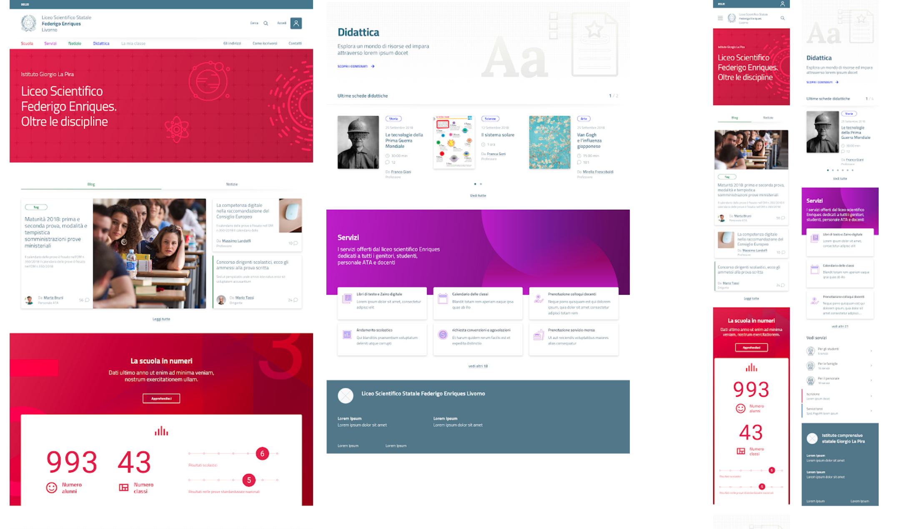
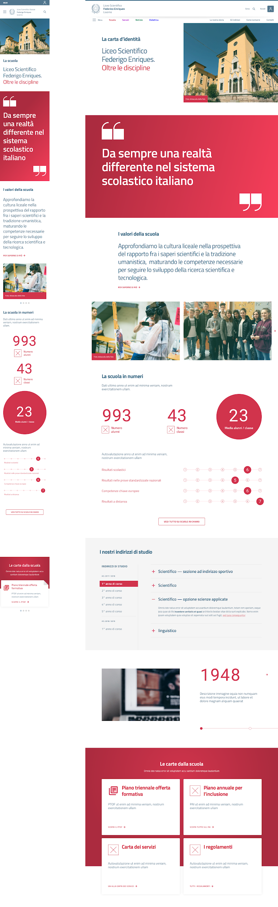
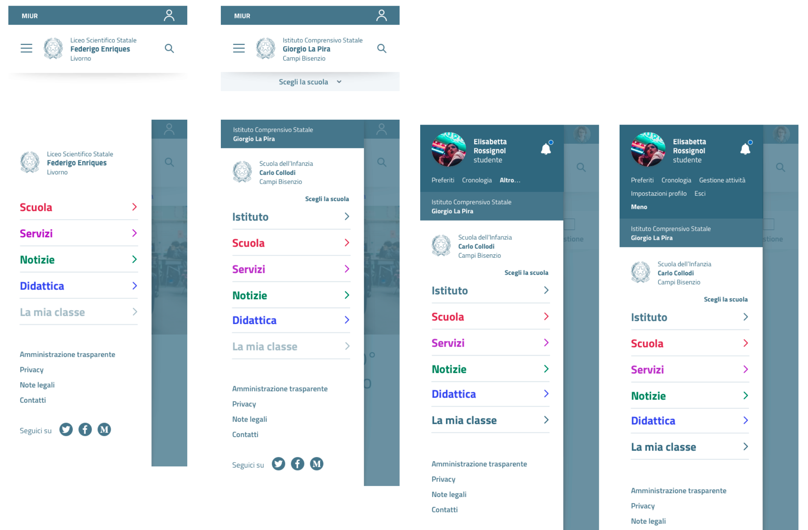
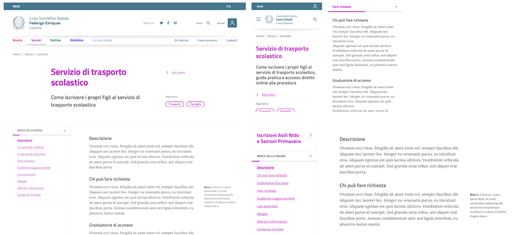

.. _prototipo-hi-fi:

Prototipo hi-fi
===============

Il prototipo hi-fi viene costruito usando lo `UI kit di Designers
Italia <https://designers.italia.it/kit/ui-kit/>`__. A sua volta, il
progetto scuole ha contribuito ad arricchire lo UI kit della Pubblica
Amministrazione, secondo il modello collaborativo di Designers Italia
che permette a ciascun progetto di contribuire concretamente a un
sistema di design condiviso.

|image0|

*Figura 1. Esempio di home page del sito di una scuola, nella versione
desktop (sinistra) e mobile (destra).*

La progettazione delle pagine è *responsive*, *mobile-first* e a moduli,
a cominciare dalla *home page* (vedi Figura 1). L'uso dei colori nella
carta d'identità della scuola permette di individuare facilmente le
quattro aree del sito. L'approccio è narrativo/redazionale per la
sezione di racconto della scuola. L'uso di infografiche e la narrazione
visiva aiutano, invece, a evidenziare numeri e dati, laddove disponibili
(vedi Figura 2).

|Prototipo hi-fi del sito delle scuole. Mobile e desktop,
rispettivamente.|

*Figura 2. Prototipo hi-fi del sito delle scuole (carta d'identità della
scuola). A sinistra la versione mobile, a destra la versione desktop.*

L'impostazione del progetto di design comincia dal branding, con una
barra di navigazione e degli header universali. Da qui è possibile
accedere alle cinque sezioni descritte in
:ref:`architettura-dellinformazione` e all'area personale. L'approccio è
verso la semplificazione, sia su desktop che su mobile, con
un'attenzione particolare alla consistenza di *look and feel* e di
accesso all'informazione. L'uso di colori accesi per le aree principali
permette di "svecchiare" la burocrazia. La Figura 3 mostra un esempio di
branding e menu di navigazione nella versione mobile.

|image2|

*Figura 3. Branding, menu di navigazione e menu dopo il login per
mobile, nelle versioni per una scuola e per un istituto comprensivo.*

Un sistema di indice di pagina permette di scorrere velocemente tra i
paragrafi delle lunghe schede: l'idea è quella di semplificare la
lettura dei contenuti il più possibile (vedi Figura 4).

|image3|

*Figura 4. Pagina di descrizione dei servizi con un indice delle sezioni
per semplificare la navigazione, nella versione desktop e mobile.*

Esplora il `prototipo hi-fi del sito delle scuole <#>`__.

